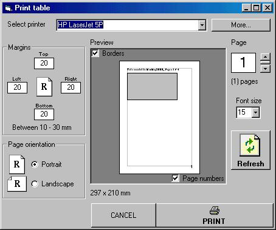



## Print a flexgrid control

### Description

The code prints a flex grid control. It supports multi page printing, by using specified number of header and footer rows by the programmer. The header and footer rows will be printed on each page, and it also has an impressive PREVIEW window which user can see the exact result of print before printing..
 
### More Info
 
1. TrnFgContainer : The container form of flex grid control

2. TrnFg As MSFlexGrid : The flex grid to be printed

3. TrnHeaderRows : The number of header rows (If you don't use it, set it to 0)

4. TrnFooterRows : The number of footer rows. (Same as header rows)

5. TrnFormatString : The format string for setting column width or row height for specified cols or rows.. k*8 bytes string, k is the total number of rows/cols to be edited.. Format is :

"xnnnvvvv" where

"x" = "c" or "r" (Column or row)

"nnn" = the number of row or col (002, 010 ...)

"vvvv" = the new width or height value in

millimeters (0040 = 40 mm = 4 cm ...)

Ex:

"c0000050c0010050r0000030"

sets column 0's width to 50 mm, column 1's width to 50 mm and row 0's height to 30 mm..

First of all, ADD THE FORM AND THE MODULE TO YOUR PROJECT..

Before showing the form, you have to send some itialization values to the control,

Put these two line of codes into the PRINT button or PRINT menu item's event, in the form which contains the flex grid control to be printed:

FrmPrintFlex.TransferValues Me,[Name of flexgrid control],[Number of header rows],[Number of footer rows],[Format string]

FrmPrintFlex.Show

             |
---                |---
**Submitted On**   |2001-06-04 17:30:14
**By**             |[Oguz Ozgul](https://github.com/Planet-Source-Code/PSCIndex/blob/master/ByAuthor/oguz-ozgul.md)
**Level**          |Advanced
**User Rating**    |4.1 (33 globes from 8 users)
**Compatibility**  |VB 5\.0, VB 6\.0
**Category**       |[Miscellaneous](https://github.com/Planet-Source-Code/PSCIndex/blob/master/ByCategory/miscellaneous__1-1.md)
**World**          |[Visual Basic](https://github.com/Planet-Source-Code/PSCIndex/blob/master/ByWorld/visual-basic.md)
**Archive File**   |[Print a fl20560642001\.zip](https://github.com/Planet-Source-Code/oguz-ozgul-print-a-flexgrid-control__1-23753/archive/master.zip)

